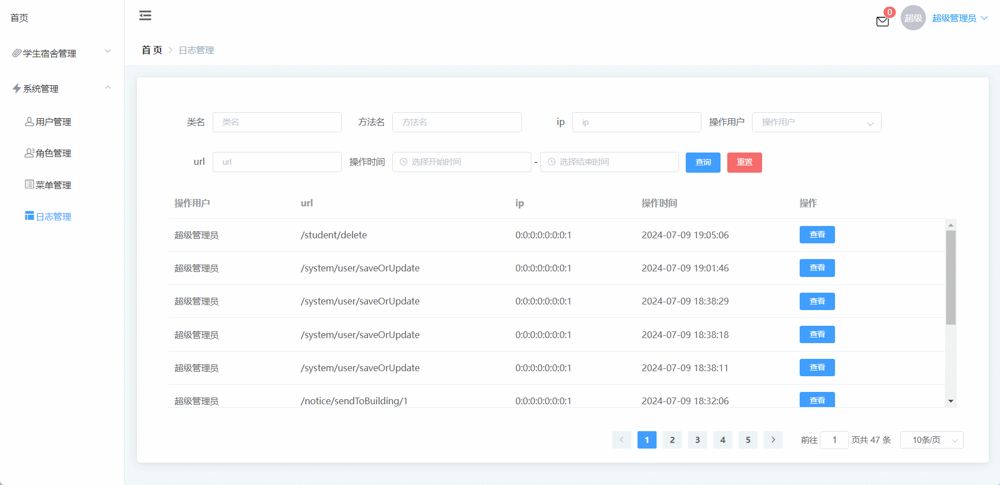
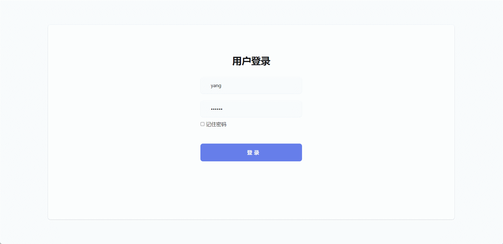

# student-dormitory🎂

基于SpringBoot+Vue的宿舍管理系统

## 介绍🌞

> 利用Spring Boot的简化配置和快速开发的特点，实现了宿舍管理，学生管理，班级管理，记录管理，晚归管理，请假管理，发送消息的功能。同时，结合前端技术，构建了友好的用户界面，实现了系统的可视化操作。

## 软件架构

1. 宿管可以进行宿舍信息的查询，学生信息查询，学生的部分信息修改，退宿，并随时查询到相关信息，删除学生。
2. 系统管理员在宿舍管理中承担重要职责，他们负责将宿舍管理人员分配至不同的角色，并为每个角色设定与之相匹配的管理职级。同时，为了确保每个角色能够在其职责范围内有效运作，管理员会为每个角色赋予相应的权限，从而清晰界定其工作范围。
3. 超级管理员拥有宿管和系统管理员的全部权限，并且拥有发送信息以及审核退宿申请的权限。

## 项目演示🌞

**管理员**




**宿管**



## 安装教程🌞

```
1. 运行环境准备mysql8 + java8 + node14.16.1 + redis

2. 配置maven路径，加载依赖

3. 运行sql文件，确保application.yml或config.properties的数据库名称和账号密码是数据库所在主机的账号密码
```


## 使用说明🌞

```
1. 登入

		管理员账号：admin 密码：123456

		宿管账号：yang 密码：123456
  
2. 运行流程

SpringBoot+Vue项目的部署详情可以查看这篇CSDN博客：http://t.csdnimg.cn/kpuxS

前后端不分离项目的部署流程可以查看这篇CSDN博客：http://t.csdnimg.cn/CslA5
```


## CSDN项目合集🌞

点击前往：http://t.csdnimg.cn/Q4u84


## 联系我🌞

**有偿获取完整源码或调试代码**

🐧：1902317191

微信：


